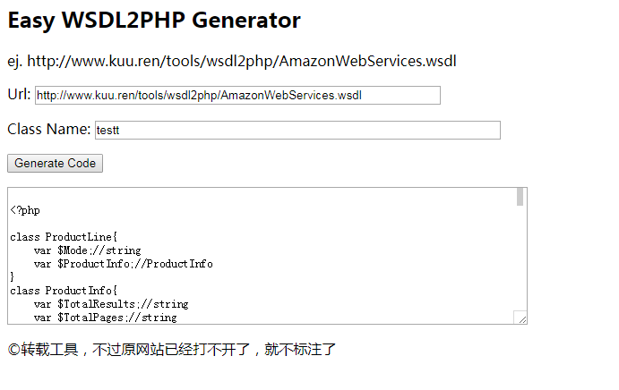

# wsdl2php
输入wsdl的链接，可以生成php调用webservice的类文件
解决过于复杂的webservice参数结构，导致php调用不成功

### demo
 [演示地址](http://www.kuu.ren/tools/wsdl2php/wsdl2php.php)
 效果如下图： 

### download
如果本地有php运行环境，可以下载后运行wsdl2php.php

[Release zip download](https://github.com/yezige/wsdl2php/releases)
